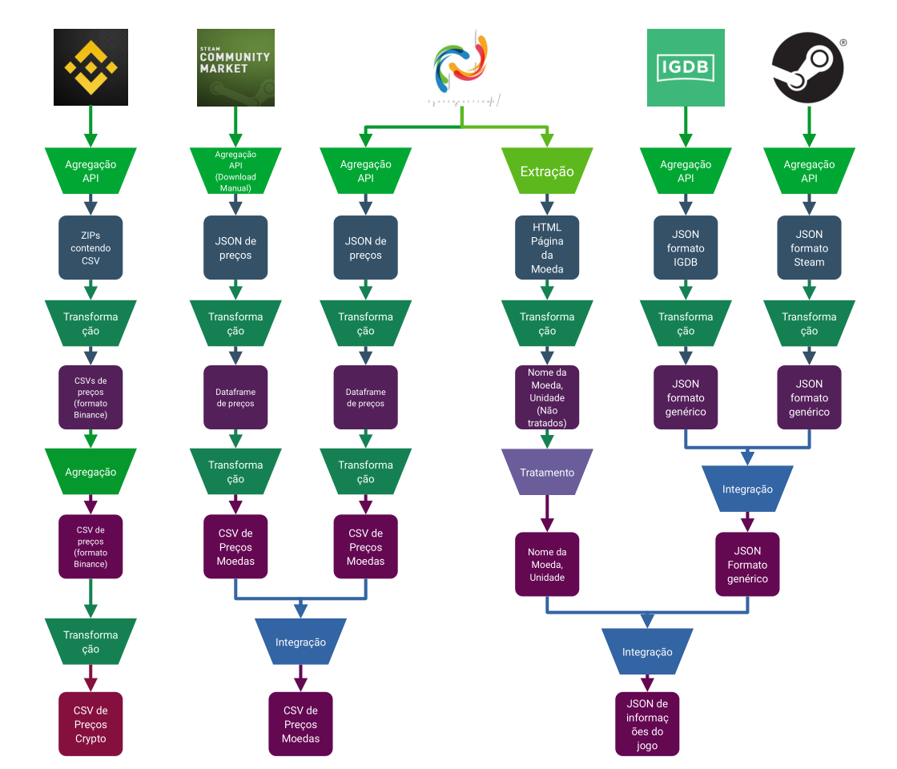

# Projeto `Construção de dataset para histórico de in-game currencies`

# Equipe devian - DVN
* `Igor Gabriel Cavalcante de Carvalho Borges` - `236773`

## Resumo do Projeto
O objetivo do projeto é construir um _dataset_ contendo os valores históricos de diversas in-game currencies, ou moedas virtuais de jogos, com o propósito de oferecer os recursos para pesquisas relacionadas ao seu comportamento e comparação com o de criptomoedas.

## Slides da Apresentação
[Apresentação](./slides/slides.pdf)

## Modelo Conceitual

## Modelos Lógicos

O modelo relacional é utilizado para todas as tabelas de preço, com a mesma assinatura:

~~~
COIN(_Date_, _Price_)
~~~

Já para os metadados dos jogos que contém as moedas, é utilizado o modelo de documentos, com o seguinte template:

~~~
{
    name: String,
    description: String
    steam: {
        steam_game: bool,
        appid: int
    },
    developers: [String],
    publishers: [String],
    platforms: [String],
    genres: [String],
    keywords: [String],
    release_date: String,
    currencies: [
      {
            id: String,
            name: String,
            price: {
                fixed_price: int,
                unit: int,
                price_table: String
            }
        }

    ]
}
~~~

## Dataset Publicado

Tabelas de Preços

título do arquivo/base | link | breve descrição
----- | ----- | -----
`./data/processed/prices/coins/4Story.csv` | [LINK](./data/processed/prices/coins/4Story.csv) | `Tabela de preços da moeda 4Story`
`./data/processed/prices/coins/8-Ball-Pool.csv` | [LINK](./data/processed/prices/coins/8-Ball-Pool.csv) | `Tabela de preços da moeda 8-Ball-Pool`
`./data/processed/prices/coins/9DS.csv` | [LINK](./data/processed/prices/coins/9DS.csv) | `Tabela de preços da moeda 9DS`
`./data/processed/prices/coins/Albion-Online.csv` | [LINK](./data/processed/prices/coins/Albion-Online.csv) | `Tabela de preços da moeda Albion-Online`
`./data/processed/prices/coins/Animal-Crossing-NH.csv` | [LINK](./data/processed/prices/coins/Animal-Crossing-NH.csv) | `Tabela de preços da moeda Animal-Crossing-NH`
`./data/processed/prices/coins/Animal-Jam.csv` | [LINK](./data/processed/prices/coins/Animal-Jam.csv) | `Tabela de preços da moeda Animal-Jam`
`./data/processed/prices/coins/Arcane-Legends.csv` | [LINK](./data/processed/prices/coins/Arcane-Legends.csv) | `Tabela de preços da moeda Arcane-Legends`
`./data/processed/prices/coins/Archeage-Unchained.csv` | [LINK](./data/processed/prices/coins/Archeage-Unchained.csv) | `Tabela de preços da moeda Archeage-Unchained`
`./data/processed/prices/coins/Aura-Kingdom.csv` | [LINK](./data/processed/prices/coins/Aura-Kingdom.csv) | `Tabela de preços da moeda Aura-Kingdom`
`./data/processed/prices/coins/Black-Desert.csv` | [LINK](./data/processed/prices/coins/Black-Desert.csv) | `Tabela de preços da moeda Black-Desert`
`./data/processed/prices/coins/Blade-Soul.csv` | [LINK](./data/processed/prices/coins/Blade-Soul.csv) | `Tabela de preços da moeda Blade-Soul`
`./data/processed/prices/coins/Bless-Unleashed.csv` | [LINK](./data/processed/prices/coins/Bless-Unleashed.csv) | `Tabela de preços da moeda Bless-Unleashed`
`./data/processed/prices/coins/coins.txt` | [LINK](./data/processed/prices/coins/coins.txt) | `Tabela de preços da moeda coins`
`./data/processed/prices/coins/Conquerors-Blade.csv` | [LINK](./data/processed/prices/coins/Conquerors-Blade.csv) | `Tabela de preços da moeda Conquerors-Blade`
`./data/processed/prices/coins/Crowfall.csv` | [LINK](./data/processed/prices/coins/Crowfall.csv) | `Tabela de preços da moeda Crowfall`
`./data/processed/prices/coins/D2.csv` | [LINK](./data/processed/prices/coins/D2.csv) | `Tabela de preços da moeda D2`
`./data/processed/prices/coins/D2R.csv` | [LINK](./data/processed/prices/coins/D2R.csv) | `Tabela de preços da moeda D2R`
`./data/processed/prices/coins/DCUO.csv` | [LINK](./data/processed/prices/coins/DCUO.csv) | `Tabela de preços da moeda DCUO`
`./data/processed/prices/coins/DDO.csv` | [LINK](./data/processed/prices/coins/DDO.csv) | `Tabela de preços da moeda DDO`
`./data/processed/prices/coins/Dead-Frontier-2.csv` | [LINK](./data/processed/prices/coins/Dead-Frontier-2.csv) | `Tabela de preços da moeda Dead-Frontier-2`
`./data/processed/prices/coins/DFO.csv` | [LINK](./data/processed/prices/coins/DFO.csv) | `Tabela de preços da moeda DFO`
`./data/processed/prices/coins/Diablo-2-Resurrected.csv` | [LINK](./data/processed/prices/coins/Diablo-2-Resurrected.csv) | `Tabela de preços da moeda Diablo-2-Resurrected`
`./data/processed/prices/coins/Digimon-Masters.csv` | [LINK](./data/processed/prices/coins/Digimon-Masters.csv) | `Tabela de preços da moeda Digimon-Masters`
`./data/processed/prices/coins/Dofus.csv` | [LINK](./data/processed/prices/coins/Dofus.csv) | `Tabela de preços da moeda Dofus`
`./data/processed/prices/coins/DOFUS.csv` | [LINK](./data/processed/prices/coins/DOFUS.csv) | `Tabela de preços da moeda DOFUS`
`./data/processed/prices/coins/Dofus-Touch.csv` | [LINK](./data/processed/prices/coins/Dofus-Touch.csv) | `Tabela de preços da moeda Dofus-Touch`
`./data/processed/prices/coins/Dragon-Nest.csv` | [LINK](./data/processed/prices/coins/Dragon-Nest.csv) | `Tabela de preços da moeda Dragon-Nest`
`./data/processed/prices/coins/Dual-Universe.csv` | [LINK](./data/processed/prices/coins/Dual-Universe.csv) | `Tabela de preços da moeda Dual-Universe`
`./data/processed/prices/coins/Elder-Scrolls-Online.csv` | [LINK](./data/processed/prices/coins/Elder-Scrolls-Online.csv) | `Tabela de preços da moeda Elder-Scrolls-Online`
`./data/processed/prices/coins/EQ2.csv` | [LINK](./data/processed/prices/coins/EQ2.csv) | `Tabela de preços da moeda EQ2`
`./data/processed/prices/coins/Escape-From-Tarkov.csv` | [LINK](./data/processed/prices/coins/Escape-From-Tarkov.csv) | `Tabela de preços da moeda Escape-From-Tarkov`
`./data/processed/prices/coins/ESO.csv` | [LINK](./data/processed/prices/coins/ESO.csv) | `Tabela de preços da moeda ESO`
`./data/processed/prices/coins/EVE.csv` | [LINK](./data/processed/prices/coins/EVE.csv) | `Tabela de preços da moeda EVE`
`./data/processed/prices/coins/EVE-Echoes.csv` | [LINK](./data/processed/prices/coins/EVE-Echoes.csv) | `Tabela de preços da moeda EVE-Echoes`
`./data/processed/prices/coins/Fallout-76.csv` | [LINK](./data/processed/prices/coins/Fallout-76.csv) | `Tabela de preços da moeda Fallout-76`
`./data/processed/prices/coins/FFXIV.csv` | [LINK](./data/processed/prices/coins/FFXIV.csv) | `Tabela de preços da moeda FFXIV`
`./data/processed/prices/coins/FIFA-22.csv` | [LINK](./data/processed/prices/coins/FIFA-22.csv) | `Tabela de preços da moeda FIFA-22`
`./data/processed/prices/coins/FIFA-Mobile.csv` | [LINK](./data/processed/prices/coins/FIFA-Mobile.csv) | `Tabela de preços da moeda FIFA-Mobile`
`./data/processed/prices/coins/Forza-Horizon-4.csv` | [LINK](./data/processed/prices/coins/Forza-Horizon-4.csv) | `Tabela de preços da moeda Forza-Horizon-4`
`./data/processed/prices/coins/Gaia.csv` | [LINK](./data/processed/prices/coins/Gaia.csv) | `Tabela de preços da moeda Gaia`
`./data/processed/prices/coins/Gloria-Victis.csv` | [LINK](./data/processed/prices/coins/Gloria-Victis.csv) | `Tabela de preços da moeda Gloria-Victis`
`./data/processed/prices/coins/GTA.csv` | [LINK](./data/processed/prices/coins/GTA.csv) | `Tabela de preços da moeda GTA`
`./data/processed/prices/coins/Guild-Wars-2.csv` | [LINK](./data/processed/prices/coins/Guild-Wars-2.csv) | `Tabela de preços da moeda Guild-Wars-2`
`./data/processed/prices/coins/GW.csv` | [LINK](./data/processed/prices/coins/GW.csv) | `Tabela de preços da moeda GW`
`./data/processed/prices/coins/Habbo.csv` | [LINK](./data/processed/prices/coins/Habbo.csv) | `Tabela de preços da moeda Habbo`
`./data/processed/prices/coins/IMVU.csv` | [LINK](./data/processed/prices/coins/IMVU.csv) | `Tabela de preços da moeda IMVU`
`./data/processed/prices/coins/L2.csv` | [LINK](./data/processed/prices/coins/L2.csv) | `Tabela de preços da moeda L2`
`./data/processed/prices/coins/Last-Oasis.csv` | [LINK](./data/processed/prices/coins/Last-Oasis.csv) | `Tabela de preços da moeda Last-Oasis`
`./data/processed/prices/coins/Legends-of-Aria.csv` | [LINK](./data/processed/prices/coins/Legends-of-Aria.csv) | `Tabela de preços da moeda Legends-of-Aria`
`./data/processed/prices/coins/Lords-Mobile.csv` | [LINK](./data/processed/prices/coins/Lords-Mobile.csv) | `Tabela de preços da moeda Lords-Mobile`
`./data/processed/prices/coins/Lost-Ark.csv` | [LINK](./data/processed/prices/coins/Lost-Ark.csv) | `Tabela de preços da moeda Lost-Ark`
`./data/processed/prices/coins/LOTRO.csv` | [LINK](./data/processed/prices/coins/LOTRO.csv) | `Tabela de preços da moeda LOTRO`
`./data/processed/prices/coins/M2.csv` | [LINK](./data/processed/prices/coins/M2.csv) | `Tabela de preços da moeda M2`
`./data/processed/prices/coins/Mabinogi.csv` | [LINK](./data/processed/prices/coins/Mabinogi.csv) | `Tabela de preços da moeda Mabinogi`
`./data/processed/prices/coins/Madden-21.csv` | [LINK](./data/processed/prices/coins/Madden-21.csv) | `Tabela de preços da moeda Madden-21`
`./data/processed/prices/coins/Madden-22.csv` | [LINK](./data/processed/prices/coins/Madden-22.csv) | `Tabela de preços da moeda Madden-22`
`./data/processed/prices/coins/Madden-NFL-Mobile.csv` | [LINK](./data/processed/prices/coins/Madden-NFL-Mobile.csv) | `Tabela de preços da moeda Madden-NFL-Mobile`
`./data/processed/prices/coins/MapleStory-2.csv` | [LINK](./data/processed/prices/coins/MapleStory-2.csv) | `Tabela de preços da moeda MapleStory-2`
`./data/processed/prices/coins/MapleStory-M.csv` | [LINK](./data/processed/prices/coins/MapleStory-M.csv) | `Tabela de preços da moeda MapleStory-M`
`./data/processed/prices/coins/MCSCK.csv` | [LINK](./data/processed/prices/coins/MCSCK.csv) | `Tabela de preços da moeda MCSCK`
`./data/processed/prices/coins/Minecraft.csv` | [LINK](./data/processed/prices/coins/Minecraft.csv) | `Tabela de preços da moeda Minecraft`
`./data/processed/prices/coins/MIR4.csv` | [LINK](./data/processed/prices/coins/MIR4.csv) | `Tabela de preços da moeda MIR4`
`./data/processed/prices/coins/MLB-The-Show-21.csv` | [LINK](./data/processed/prices/coins/MLB-The-Show-21.csv) | `Tabela de preços da moeda MLB-The-Show-21`
`./data/processed/prices/coins/NBA-2K20.csv` | [LINK](./data/processed/prices/coins/NBA-2K20.csv) | `Tabela de preços da moeda NBA-2K20`
`./data/processed/prices/coins/NBA-2K21.csv` | [LINK](./data/processed/prices/coins/NBA-2K21.csv) | `Tabela de preços da moeda NBA-2K21`
`./data/processed/prices/coins/NBA-2K22.csv` | [LINK](./data/processed/prices/coins/NBA-2K22.csv) | `Tabela de preços da moeda NBA-2K22`
`./data/processed/prices/coins/NBA-Live-Mobile.csv` | [LINK](./data/processed/prices/coins/NBA-Live-Mobile.csv) | `Tabela de preços da moeda NBA-Live-Mobile`
`./data/processed/prices/coins/Neopets.csv` | [LINK](./data/processed/prices/coins/Neopets.csv) | `Tabela de preços da moeda Neopets`
`./data/processed/prices/coins/Never-Winter.csv` | [LINK](./data/processed/prices/coins/Never-Winter.csv) | `Tabela de preços da moeda Never-Winter`
`./data/processed/prices/coins/New-World.csv` | [LINK](./data/processed/prices/coins/New-World.csv) | `Tabela de preços da moeda New-World`
`./data/processed/prices/coins/NHL-21.csv` | [LINK](./data/processed/prices/coins/NHL-21.csv) | `Tabela de preços da moeda NHL-21`
`./data/processed/prices/coins/OSRS.csv` | [LINK](./data/processed/prices/coins/OSRS.csv) | `Tabela de preços da moeda OSRS`
`./data/processed/prices/coins/Path-of-Exile.csv` | [LINK](./data/processed/prices/coins/Path-of-Exile.csv) | `Tabela de preços da moeda Path-of-Exile`
`./data/processed/prices/coins/PokeMMO.csv` | [LINK](./data/processed/prices/coins/PokeMMO.csv) | `Tabela de preços da moeda PokeMMO`
`./data/processed/prices/coins/PSO2.csv` | [LINK](./data/processed/prices/coins/PSO2.csv) | `Tabela de preços da moeda PSO2`
`./data/processed/prices/coins/PSO2NGS.csv` | [LINK](./data/processed/prices/coins/PSO2NGS.csv) | `Tabela de preços da moeda PSO2NGS`
`./data/processed/prices/coins/RDR2.csv` | [LINK](./data/processed/prices/coins/RDR2.csv) | `Tabela de preços da moeda RDR2`
`./data/processed/prices/coins/render_graph.py` | [LINK](./data/processed/prices/coins/render_graph.py) | `Tabela de preços da moeda render_graph`
`./data/processed/prices/coins/Revelation-Online.csv` | [LINK](./data/processed/prices/coins/Revelation-Online.csv) | `Tabela de preços da moeda Revelation-Online`
`./data/processed/prices/coins/Rift.csv` | [LINK](./data/processed/prices/coins/Rift.csv) | `Tabela de preços da moeda Rift`
`./data/processed/prices/coins/ROBLOX.csv` | [LINK](./data/processed/prices/coins/ROBLOX.csv) | `Tabela de preços da moeda ROBLOX`
`./data/processed/prices/coins/Rocket-League.csv` | [LINK](./data/processed/prices/coins/Rocket-League.csv) | `Tabela de preços da moeda Rocket-League`
`./data/processed/prices/coins/RO.csv` | [LINK](./data/processed/prices/coins/RO.csv) | `Tabela de preços da moeda RO`
`./data/processed/prices/coins/RuneScape.csv` | [LINK](./data/processed/prices/coins/RuneScape.csv) | `Tabela de preços da moeda RuneScape`
`./data/processed/prices/coins/SL.csv` | [LINK](./data/processed/prices/coins/SL.csv) | `Tabela de preços da moeda SL`
`./data/processed/prices/coins/Smite.csv` | [LINK](./data/processed/prices/coins/Smite.csv) | `Tabela de preços da moeda Smite`
`./data/processed/prices/coins/Starbase.csv` | [LINK](./data/processed/prices/coins/Starbase.csv) | `Tabela de preços da moeda Starbase`
`./data/processed/prices/coins/stats_queries.py` | [LINK](./data/processed/prices/coins/stats_queries.py) | `Tabela de preços da moeda stats_queries`
`./data/processed/prices/coins/STO.csv` | [LINK](./data/processed/prices/coins/STO.csv) | `Tabela de preços da moeda STO`
`./data/processed/prices/coins/style.mplstyle` | [LINK](./data/processed/prices/coins/style.mplstyle) | `Tabela de preços da moeda style`
`./data/processed/prices/coins/sussy.py` | [LINK](./data/processed/prices/coins/sussy.py) | `Tabela de preços da moeda sussy`
`./data/processed/prices/coins/Swords-of-Legends.csv` | [LINK](./data/processed/prices/coins/Swords-of-Legends.csv) | `Tabela de preços da moeda Swords-of-Legends`
`./data/processed/prices/coins/SWTOR.csv` | [LINK](./data/processed/prices/coins/SWTOR.csv) | `Tabela de preços da moeda SWTOR`
`./data/processed/prices/coins/Temtem.csv` | [LINK](./data/processed/prices/coins/Temtem.csv) | `Tabela de preços da moeda Temtem`
`./data/processed/prices/coins/Tera.csv` | [LINK](./data/processed/prices/coins/Tera.csv) | `Tabela de preços da moeda Tera`
`./data/processed/prices/coins/Tibia.csv` | [LINK](./data/processed/prices/coins/Tibia.csv) | `Tabela de preços da moeda Tibia`
`./data/processed/prices/coins/Toram-Online.csv` | [LINK](./data/processed/prices/coins/Toram-Online.csv) | `Tabela de preços da moeda Toram-Online`
`./data/processed/prices/coins/Tree-of-Savior.csv` | [LINK](./data/processed/prices/coins/Tree-of-Savior.csv) | `Tabela de preços da moeda Tree-of-Savior`
`./data/processed/prices/coins/Trove.csv` | [LINK](./data/processed/prices/coins/Trove.csv) | `Tabela de preços da moeda Trove`
`./data/processed/prices/coins/V4.csv` | [LINK](./data/processed/prices/coins/V4.csv) | `Tabela de preços da moeda V4`
`./data/processed/prices/coins/Vindictus.csv` | [LINK](./data/processed/prices/coins/Vindictus.csv) | `Tabela de preços da moeda Vindictus`
`./data/processed/prices/coins/Wakfu.csv` | [LINK](./data/processed/prices/coins/Wakfu.csv) | `Tabela de preços da moeda Wakfu`
`./data/processed/prices/coins/Warframe.csv` | [LINK](./data/processed/prices/coins/Warframe.csv) | `Tabela de preços da moeda Warframe`
`./data/processed/prices/coins/Wildstar.csv` | [LINK](./data/processed/prices/coins/Wildstar.csv) | `Tabela de preços da moeda Wildstar`
`./data/processed/prices/coins/Wild-Terra-2.csv` | [LINK](./data/processed/prices/coins/Wild-Terra-2.csv) | `Tabela de preços da moeda Wild-Terra-2`
`./data/processed/prices/coins/Wizard101.csv` | [LINK](./data/processed/prices/coins/Wizard101.csv) | `Tabela de preços da moeda Wizard101`
`./data/processed/prices/coins/Wolcen.csv` | [LINK](./data/processed/prices/coins/Wolcen.csv) | `Tabela de preços da moeda Wolcen`
`./data/processed/prices/coins/WoW-Classic.csv` | [LINK](./data/processed/prices/coins/WoW-Classic.csv) | `Tabela de preços da moeda WoW-Classic`
`./data/processed/prices/coins/WoW-Classic-TBC.csv` | [LINK](./data/processed/prices/coins/WoW-Classic-TBC.csv) | `Tabela de preços da moeda WoW-Classic-TBC`
`./data/processed/prices/coins/WoW.csv` | [LINK](./data/processed/prices/coins/WoW.csv) | `Tabela de preços da moeda WoW`
`./data/processed/prices/coins/WoW-EU.csv` | [LINK](./data/processed/prices/coins/WoW-EU.csv) | `Tabela de preços da moeda WoW-EU`

Tabela de preços de criptomoedas

título do arquivo/base | link | breve descrição
----- | ----- | -----
`./data/processed/crypto/ADAUSDT.csv` | [LINK](./data/processed/crypto/ADAUSDT.csv) | `Tabela de preços para o par ADAUSDT`
`./data/processed/crypto/BNBUSDT.csv` | [LINK](./data/processed/crypto/BNBUSDT.csv) | `Tabela de preços para o par BNBUSDT`
`./data/processed/crypto/BTCUSDT.csv` | [LINK](./data/processed/crypto/BTCUSDT.csv) | `Tabela de preços para o par BTCUSDT`
`./data/processed/crypto/DOGEUSDT.csv` | [LINK](./data/processed/crypto/DOGEUSDT.csv) | `Tabela de preços para o par DOGEUSDT`
`./data/processed/crypto/DOTUSDT.csv` | [LINK](./data/processed/crypto/DOTUSDT.csv) | `Tabela de preços para o par DOTUSDT`
`./data/processed/crypto/ETHUSDT.csv` | [LINK](./data/processed/crypto/ETHUSDT.csv) | `Tabela de preços para o par ETHUSDT`
`./data/processed/crypto/SHIBUSDT.csv` | [LINK](./data/processed/crypto/SHIBUSDT.csv) | `Tabela de preços para o par SHIBUSDT`
`./data/processed/crypto/SOLUSDT.csv` | [LINK](./data/processed/crypto/SOLUSDT.csv) | `Tabela de preços para o par SOLUSDT`
`./data/processed/crypto/XRPUSDT.csv` | [LINK](./data/processed/crypto/XRPUSDT.csv) | `Tabela de preços para o par XRPUSDT`

Informações de jogos

título do arquivo/base | link | breve descrição
----- | ----- | -----
`./data/processed/coins/4Story\ Online.json` | [LINK](./data/processed/coins/4Story\ Online.json) | `Informações sobre o jogo 4Story\ Online`
`./data/processed/coins/Albion\ Online.json` | [LINK](./data/processed/coins/Albion\ Online.json) | `Informações sobre o jogo Albion\ Online`
`./data/processed/coins/Animal\ Crossing:\ New\ Horizons.json` | [LINK](./data/processed/coins/Animal\ Crossing:\ New\ Horizons.json) | `Informações sobre o jogo Animal\ Crossing:\ New\ Horizons`
`./data/processed/coins/Animal\ Jam.json` | [LINK](./data/processed/coins/Animal\ Jam.json) | `Informações sobre o jogo Animal\ Jam`
`./data/processed/coins/Arcane\ Legends.json` | [LINK](./data/processed/coins/Arcane\ Legends.json) | `Informações sobre o jogo Arcane\ Legends`
`./data/processed/coins/ArcheAge:\ Unchained.json` | [LINK](./data/processed/coins/ArcheAge:\ Unchained.json) | `Informações sobre o jogo ArcheAge:\ Unchained`
`./data/processed/coins/Aura\ Kingdom.json` | [LINK](./data/processed/coins/Aura\ Kingdom.json) | `Informações sobre o jogo Aura\ Kingdom`
`./data/processed/coins/Black\ Desert.json` | [LINK](./data/processed/coins/Black\ Desert.json) | `Informações sobre o jogo Black\ Desert`
`./data/processed/coins/Blade\ &\ Soul.json` | [LINK](./data/processed/coins/Blade\ &\ Soul.json) | `Informações sobre o jogo Blade\ &\ Soul`
`./data/processed/coins/Bless\ Unleashed.json` | [LINK](./data/processed/coins/Bless\ Unleashed.json) | `Informações sobre o jogo Bless\ Unleashed`
`./data/processed/coins/Conqueror's\ Blade.json` | [LINK](./data/processed/coins/Conqueror's\ Blade.json) | `Informações sobre o jogo Conqueror's\ Blade`
`./data/processed/coins/Crowfall.json` | [LINK](./data/processed/coins/Crowfall.json) | `Informações sobre o jogo Crowfall`
`./data/processed/coins/DC\ Universe\ Online.json` | [LINK](./data/processed/coins/DC\ Universe\ Online.json) | `Informações sobre o jogo DC\ Universe\ Online`
`./data/processed/coins/Dead\ Frontier\ 2.json` | [LINK](./data/processed/coins/Dead\ Frontier\ 2.json) | `Informações sobre o jogo Dead\ Frontier\ 2`
`./data/processed/coins/Diablo\ II.json` | [LINK](./data/processed/coins/Diablo\ II.json) | `Informações sobre o jogo Diablo\ II`
`./data/processed/coins/Diablo\ II:\ Resurrected.json` | [LINK](./data/processed/coins/Diablo\ II:\ Resurrected.json) | `Informações sobre o jogo Diablo\ II:\ Resurrected`
`./data/processed/coins/Digimon\ Masters\ Online.json` | [LINK](./data/processed/coins/Digimon\ Masters\ Online.json) | `Informações sobre o jogo Digimon\ Masters\ Online`
`./data/processed/coins/Dofus.json` | [LINK](./data/processed/coins/Dofus.json) | `Informações sobre o jogo Dofus`
`./data/processed/coins/Dofus\ Retro.json` | [LINK](./data/processed/coins/Dofus\ Retro.json) | `Informações sobre o jogo Dofus\ Retro`
`./data/processed/coins/DOFUS\ Touch.json` | [LINK](./data/processed/coins/DOFUS\ Touch.json) | `Informações sobre o jogo DOFUS\ Touch`
`./data/processed/coins/Dragon\ Nest.json` | [LINK](./data/processed/coins/Dragon\ Nest.json) | `Informações sobre o jogo Dragon\ Nest`
`./data/processed/coins/Dragon\ Quest\ IX:\ Sentinels\ of\ the\ Starry\ Skies.json` | [LINK](./data/processed/coins/Dragon\ Quest\ IX:\ Sentinels\ of\ the\ Starry\ Skies.json) | `Informações sobre o jogo Dragon\ Quest\ IX:\ Sentinels\ of\ the\ Starry\ Skies`
`./data/processed/coins/DrumMania\ v4.json` | [LINK](./data/processed/coins/DrumMania\ v4.json) | `Informações sobre o jogo DrumMania\ v4`
`./data/processed/coins/Dual\ Universe.json` | [LINK](./data/processed/coins/Dual\ Universe.json) | `Informações sobre o jogo Dual\ Universe`
`./data/processed/coins/Dungeon\ Fighter\ Online.json` | [LINK](./data/processed/coins/Dungeon\ Fighter\ Online.json) | `Informações sobre o jogo Dungeon\ Fighter\ Online`
`./data/processed/coins/Dungeons\ &\ Dragons.json` | [LINK](./data/processed/coins/Dungeons\ &\ Dragons.json) | `Informações sobre o jogo Dungeons\ &\ Dragons`
`./data/processed/coins/Escape\ from\ Tarkov.json` | [LINK](./data/processed/coins/Escape\ from\ Tarkov.json) | `Informações sobre o jogo Escape\ from\ Tarkov`
`./data/processed/coins/EVE:\ Echoes.json` | [LINK](./data/processed/coins/EVE:\ Echoes.json) | `Informações sobre o jogo EVE:\ Echoes`
`./data/processed/coins/EVE\ Online.json` | [LINK](./data/processed/coins/EVE\ Online.json) | `Informações sobre o jogo EVE\ Online`
`./data/processed/coins/EverQuest\ II.json` | [LINK](./data/processed/coins/EverQuest\ II.json) | `Informações sobre o jogo EverQuest\ II`
`./data/processed/coins/Fallout\ 76.json` | [LINK](./data/processed/coins/Fallout\ 76.json) | `Informações sobre o jogo Fallout\ 76`
`./data/processed/coins/FIFA\ 22.json` | [LINK](./data/processed/coins/FIFA\ 22.json) | `Informações sobre o jogo FIFA\ 22`
`./data/processed/coins/FIFA\ Mobile\ World.json` | [LINK](./data/processed/coins/FIFA\ Mobile\ World.json) | `Informações sobre o jogo FIFA\ Mobile\ World`
`./data/processed/coins/Final\ Fantasy\ VI:\ Brave\ New\ World.json` | [LINK](./data/processed/coins/Final\ Fantasy\ VI:\ Brave\ New\ World.json) | `Informações sobre o jogo Final\ Fantasy\ VI:\ Brave\ New\ World`
`./data/processed/coins/Final\ Fantasy\ XIV\ Online.json` | [LINK](./data/processed/coins/Final\ Fantasy\ XIV\ Online.json) | `Informações sobre o jogo Final\ Fantasy\ XIV\ Online`
`./data/processed/coins/Final\ Fantasy\ XIV:\ Stormblood.json` | [LINK](./data/processed/coins/Final\ Fantasy\ XIV:\ Stormblood.json) | `Informações sobre o jogo Final\ Fantasy\ XIV:\ Stormblood`
`./data/processed/coins/Forza\ Horizon\ 4:\ Expansions\ Bundle.json` | [LINK](./data/processed/coins/Forza\ Horizon\ 4:\ Expansions\ Bundle.json) | `Informações sobre o jogo Forza\ Horizon\ 4:\ Expansions\ Bundle`
`./data/processed/coins/Gaia\ Online.json` | [LINK](./data/processed/coins/Gaia\ Online.json) | `Informações sobre o jogo Gaia\ Online`
`./data/processed/coins/Gloria\ Victis.json` | [LINK](./data/processed/coins/Gloria\ Victis.json) | `Informações sobre o jogo Gloria\ Victis`
`./data/processed/coins/Grand\ Theft\ Auto\ V.json` | [LINK](./data/processed/coins/Grand\ Theft\ Auto\ V.json) | `Informações sobre o jogo Grand\ Theft\ Auto\ V`
`./data/processed/coins/Grand\ Theft\ Auto\ V:\ Premium\ Online\ Edition.json` | [LINK](./data/processed/coins/Grand\ Theft\ Auto\ V:\ Premium\ Online\ Edition.json) | `Informações sobre o jogo Grand\ Theft\ Auto\ V:\ Premium\ Online\ Edition`
`./data/processed/coins/Guild\ Wars\ 2.json` | [LINK](./data/processed/coins/Guild\ Wars\ 2.json) | `Informações sobre o jogo Guild\ Wars\ 2`
`./data/processed/coins/Guild\ Wars.json` | [LINK](./data/processed/coins/Guild\ Wars.json) | `Informações sobre o jogo Guild\ Wars`
`./data/processed/coins/Habbo.json` | [LINK](./data/processed/coins/Habbo.json) | `Informações sobre o jogo Habbo`
`./data/processed/coins/IMVU.json` | [LINK](./data/processed/coins/IMVU.json) | `Informações sobre o jogo IMVU`
`./data/processed/coins/Last\ Oasis.json` | [LINK](./data/processed/coins/Last\ Oasis.json) | `Informações sobre o jogo Last\ Oasis`
`./data/processed/coins/Legends\ of\ Aria.json` | [LINK](./data/processed/coins/Legends\ of\ Aria.json) | `Informações sobre o jogo Legends\ of\ Aria`
`./data/processed/coins/Lineage\ 2.json` | [LINK](./data/processed/coins/Lineage\ 2.json) | `Informações sobre o jogo Lineage\ 2`
`./data/processed/coins/Lords\ Mobile.json` | [LINK](./data/processed/coins/Lords\ Mobile.json) | `Informações sobre o jogo Lords\ Mobile`
`./data/processed/coins/LOST\ ARK.json` | [LINK](./data/processed/coins/LOST\ ARK.json) | `Informações sobre o jogo LOST\ ARK`
`./data/processed/coins/Mabinogi.json` | [LINK](./data/processed/coins/Mabinogi.json) | `Informações sobre o jogo Mabinogi`
`./data/processed/coins/Madden\ NFL\ 21.json` | [LINK](./data/processed/coins/Madden\ NFL\ 21.json) | `Informações sobre o jogo Madden\ NFL\ 21`
`./data/processed/coins/Madden\ NFL\ 22.json` | [LINK](./data/processed/coins/Madden\ NFL\ 22.json) | `Informações sobre o jogo Madden\ NFL\ 22`
`./data/processed/coins/Madden\ NFL\ Mobile.json` | [LINK](./data/processed/coins/Madden\ NFL\ Mobile.json) | `Informações sobre o jogo Madden\ NFL\ Mobile`
`./data/processed/coins/MapleStory\ 2.json` | [LINK](./data/processed/coins/MapleStory\ 2.json) | `Informações sobre o jogo MapleStory\ 2`
`./data/processed/coins/MapleStory\ M.json` | [LINK](./data/processed/coins/MapleStory\ M.json) | `Informações sobre o jogo MapleStory\ M`
`./data/processed/coins/Metin2.json` | [LINK](./data/processed/coins/Metin2.json) | `Informações sobre o jogo Metin2`
`./data/processed/coins/Minecraft\ China.json` | [LINK](./data/processed/coins/Minecraft\ China.json) | `Informações sobre o jogo Minecraft\ China`
`./data/processed/coins/Minecraft.json` | [LINK](./data/processed/coins/Minecraft.json) | `Informações sobre o jogo Minecraft`
`./data/processed/coins/MIR4.json` | [LINK](./data/processed/coins/MIR4.json) | `Informações sobre o jogo MIR4`
`./data/processed/coins/MLB\ The\ Show\ 21.json` | [LINK](./data/processed/coins/MLB\ The\ Show\ 21.json) | `Informações sobre o jogo MLB\ The\ Show\ 21`
`./data/processed/coins/NBA\ 2K20.json` | [LINK](./data/processed/coins/NBA\ 2K20.json) | `Informações sobre o jogo NBA\ 2K20`
`./data/processed/coins/NBA\ 2K21.json` | [LINK](./data/processed/coins/NBA\ 2K21.json) | `Informações sobre o jogo NBA\ 2K21`
`./data/processed/coins/NBA\ 2K22:\ NBA\ 75th\ Anniversary\ Edition.json` | [LINK](./data/processed/coins/NBA\ 2K22:\ NBA\ 75th\ Anniversary\ Edition.json) | `Informações sobre o jogo NBA\ 2K22:\ NBA\ 75th\ Anniversary\ Edition`
`./data/processed/coins/NBA\ LIVE\ Mobile.json` | [LINK](./data/processed/coins/NBA\ LIVE\ Mobile.json) | `Informações sobre o jogo NBA\ LIVE\ Mobile`
`./data/processed/coins/Neopets\ Browser.json` | [LINK](./data/processed/coins/Neopets\ Browser.json) | `Informações sobre o jogo Neopets\ Browser`
`./data/processed/coins/Neverwinter.json` | [LINK](./data/processed/coins/Neverwinter.json) | `Informações sobre o jogo Neverwinter`
`./data/processed/coins/NHL\ 21.json` | [LINK](./data/processed/coins/NHL\ 21.json) | `Informações sobre o jogo NHL\ 21`
`./data/processed/coins/Old\ School\ RuneScape.json` | [LINK](./data/processed/coins/Old\ School\ RuneScape.json) | `Informações sobre o jogo Old\ School\ RuneScape`
`./data/processed/coins/Path\ of\ Exile\ 2.json` | [LINK](./data/processed/coins/Path\ of\ Exile\ 2.json) | `Informações sobre o jogo Path\ of\ Exile\ 2`
`./data/processed/coins/Phantasy\ Star\ Online\ 2.json` | [LINK](./data/processed/coins/Phantasy\ Star\ Online\ 2.json) | `Informações sobre o jogo Phantasy\ Star\ Online\ 2`
`./data/processed/coins/Phantasy\ Star\ Online\ 2\ New\ Genesis.json` | [LINK](./data/processed/coins/Phantasy\ Star\ Online\ 2\ New\ Genesis.json) | `Informações sobre o jogo Phantasy\ Star\ Online\ 2\ New\ Genesis`
`./data/processed/coins/PokeMMO.json` | [LINK](./data/processed/coins/PokeMMO.json) | `Informações sobre o jogo PokeMMO`
`./data/processed/coins/Pool\ 8\ Ball.json` | [LINK](./data/processed/coins/Pool\ 8\ Ball.json) | `Informações sobre o jogo Pool\ 8\ Ball`
`./data/processed/coins/Ragnarok\ Online\ 2.json` | [LINK](./data/processed/coins/Ragnarok\ Online\ 2.json) | `Informações sobre o jogo Ragnarok\ Online\ 2`
`./data/processed/coins/Red\ Dead\ Redemption\ 2.json` | [LINK](./data/processed/coins/Red\ Dead\ Redemption\ 2.json) | `Informações sobre o jogo Red\ Dead\ Redemption\ 2`
`./data/processed/coins/Revelation\ Online.json` | [LINK](./data/processed/coins/Revelation\ Online.json) | `Informações sobre o jogo Revelation\ Online`
`./data/processed/coins/Rift.json` | [LINK](./data/processed/coins/Rift.json) | `Informações sobre o jogo Rift`
`./data/processed/coins/Roblox.json` | [LINK](./data/processed/coins/Roblox.json) | `Informações sobre o jogo Roblox`
`./data/processed/coins/Rocket\ League.json` | [LINK](./data/processed/coins/Rocket\ League.json) | `Informações sobre o jogo Rocket\ League`
`./data/processed/coins/RuneScape.json` | [LINK](./data/processed/coins/RuneScape.json) | `Informações sobre o jogo RuneScape`
`./data/processed/coins/Second\ Life.json` | [LINK](./data/processed/coins/Second\ Life.json) | `Informações sobre o jogo Second\ Life`
`./data/processed/coins/SMITE.json` | [LINK](./data/processed/coins/SMITE.json) | `Informações sobre o jogo SMITE`
`./data/processed/coins/Starbase.json` | [LINK](./data/processed/coins/Starbase.json) | `Informações sobre o jogo Starbase`
`./data/processed/coins/Star\ Trek\ Online.json` | [LINK](./data/processed/coins/Star\ Trek\ Online.json) | `Informações sobre o jogo Star\ Trek\ Online`
`./data/processed/coins/Star\ Wars:\ The\ Old\ Republic.json` | [LINK](./data/processed/coins/Star\ Wars:\ The\ Old\ Republic.json) | `Informações sobre o jogo Star\ Wars:\ The\ Old\ Republic`
`./data/processed/coins/Swords\ of\ Legends\ Online.json` | [LINK](./data/processed/coins/Swords\ of\ Legends\ Online.json) | `Informações sobre o jogo Swords\ of\ Legends\ Online`
`./data/processed/coins/Team\ Fortress\ 2.json` | [LINK](./data/processed/coins/Team\ Fortress\ 2.json) | `Informações sobre o jogo Team\ Fortress\ 2`
`./data/processed/coins/Temtem.json` | [LINK](./data/processed/coins/Temtem.json) | `Informações sobre o jogo Temtem`
`./data/processed/coins/TERA.json` | [LINK](./data/processed/coins/TERA.json) | `Informações sobre o jogo TERA`
`./data/processed/coins/The\ Elder\ Scrolls\ Online.json` | [LINK](./data/processed/coins/The\ Elder\ Scrolls\ Online.json) | `Informações sobre o jogo The\ Elder\ Scrolls\ Online`
`./data/processed/coins/The\ Lord\ of\ the\ Rings\ Online.json` | [LINK](./data/processed/coins/The\ Lord\ of\ the\ Rings\ Online.json) | `Informações sobre o jogo The\ Lord\ of\ the\ Rings\ Online`
`./data/processed/coins/Tibia.json` | [LINK](./data/processed/coins/Tibia.json) | `Informações sobre o jogo Tibia`
`./data/processed/coins/Toram\ Online.json` | [LINK](./data/processed/coins/Toram\ Online.json) | `Informações sobre o jogo Toram\ Online`
`./data/processed/coins/Tree\ of\ Savior.json` | [LINK](./data/processed/coins/Tree\ of\ Savior.json) | `Informações sobre o jogo Tree\ of\ Savior`
`./data/processed/coins/Trove.json` | [LINK](./data/processed/coins/Trove.json) | `Informações sobre o jogo Trove`
`./data/processed/coins/Vindictus.json` | [LINK](./data/processed/coins/Vindictus.json) | `Informações sobre o jogo Vindictus`
`./data/processed/coins/Wakfu.json` | [LINK](./data/processed/coins/Wakfu.json) | `Informações sobre o jogo Wakfu`
`./data/processed/coins/Warframe.json` | [LINK](./data/processed/coins/Warframe.json) | `Informações sobre o jogo Warframe`
`./data/processed/coins/WildStar.json` | [LINK](./data/processed/coins/WildStar.json) | `Informações sobre o jogo WildStar`
`./data/processed/coins/Wild\ Terra\ 2:\ New\ Lands.json` | [LINK](./data/processed/coins/Wild\ Terra\ 2:\ New\ Lands.json) | `Informações sobre o jogo Wild\ Terra\ 2:\ New\ Lands`
`./data/processed/coins/Wizard101.json` | [LINK](./data/processed/coins/Wizard101.json) | `Informações sobre o jogo Wizard101`
`./data/processed/coins/Wolcen:\ Lords\ of\ Mayhem.json` | [LINK](./data/processed/coins/Wolcen:\ Lords\ of\ Mayhem.json) | `Informações sobre o jogo Wolcen:\ Lords\ of\ Mayhem`
`./data/processed/coins/World\ of\ Warcraft:\ Burning\ Crusade\ Classic.json` | [LINK](./data/processed/coins/World\ of\ Warcraft:\ Burning\ Crusade\ Classic.json) | `Informações sobre o jogo World\ of\ Warcraft:\ Burning\ Crusade\ Classic`
`./data/processed/coins/World\ of\ Warcraft.json` | [LINK](./data/processed/coins/World\ of\ Warcraft.json) | `Informações sobre o jogo World\ of\ Warcraft`

## Bases de Dados

título da base | link | breve descrição
----- | ----- | -----
`Player Auctions` | [LINK](https://www.playerauctions.com/market-price-tracker) | `Site de compra e venda de ingame itens. Contém histórico de preços`
`Steam Marketplace` | [LINK](https://steamcommunity.com/market/) | `Mercado da comunidade Steam. Contém histórico de preços`
`Steam` | [LINK](https://store.steampowered.com/api/) | `Loja da Steam. Possui informações sobre jogos`
`IGDB` | [LINK](https://api.igdb.com/v4/games/) | `Base de dados de informações sobre jogos`
`Binance` | [LINK](https://data.binance.vision) | `Contém dados e histórico de preços de criptomoedas`

## Detalhamento do Projeto

O dataset foi construído a partir da obtenção e tratamento dos dados das fontes citadas anteriormente, gerando novos conjuntos de dados em três categorias:
- Tabelas em CSV de preços de moeda virtual (via Steam e PlayerAuctions)
- Tabelas em CSV de preços de criptomoedas (via Binance)
- Documentos JSON contendo informações sobre os jogos que possuem as moedas virtuais (via Steam e IGDB)

Foram utilizadas diversas operações para conversão dos dados das fontes nos que estão disponíveis na versão final, em múltiplas etapas, que estão apresentadas na figura:

Além disso, foram geradas queries de análise sobre os dados, cujo uso pode ser encontrado no seguinte [notebook](./notebooks/technical_analysis.ipynb) e implementação no seguinte [arquivo](./notebooks/stats_queries.py), por conta de seu tamanho.

## Evolução do Projeto

Desde a primeira iteração do projeto, diversas alterações, descobertas e dificuldades ocorreram. A primeira delas foi a inviabilização da API do Backpack.tf como fonte de dados, pela inabilidade de realizar queries sem mensagem de erro, aparentemente não relacionada com a corretude da query. Outra dificuldade foi a obtenção de históricos de lojas como Amazon e Ebay, que não possuem API pública de fácil acesso, e cujas alternativas são baseadas em assinaturas de alto custo.  
A segunda evolução ocorreu na entrega parcial, com a simplificação do modelo conceitual e elaboração dos modelos lógicos, como na figura:

A mudança explicita os campos do elemento "Video Game" e remove a seção contendo eventos de jogos, que se mostrou muito complexa de obter e com relevância insuficiente para justificar seu custo de tempo.
A terceira evolução, ainda no mesmo período, foi a introdução de queries iniciais em SQL para análise preliminar dos dados.

Taxa de conversão entre moedas:  
  
Resumo anual de uma moeda:  
  
Resumo de uma moeda em função de outra:  
  

As queries revelaram uma tendência interessante na volatilidade dos tipos de moedas:
  
Como pode ser observado nos exemplos, a volatilidade de criptomoedas é extremamente grande e instável, enquanto a das moedas virtuais flutua ao redor do mesmo valor.

O terceiro desenvolvimento ocorreu próxima da terceira entrega, com o desenvolvimento de queries mais elaboradas. Foram escolhidas implementações de indicadores de análise técnica em SQL. Isso se revelou um grande desafio, pois o cálculo desses indicadores requer recursão e queries bastante verbosas. A dificuldade de gerar resultados corretos aliada ao limite de tempo e a necessidade de completar outros componentes do projeto levou a um atraso na entrega.  
Porém, a implementações dessas queries e a criação de gráficos para visualizá-las permitiu a observação de tendências adicionais no comportamento das moedas, como:
- Similaridade no comportamento de criptomoedas, causadas pelo relativo domínio da Bitcoin no mercado como um todo
- Comportamento irregular e diferente entre as moedas virtuais, embora com escala de volatilidade bem menor.
- Padrões de comportamento presentes em algumas moedas virtuais:
  - Regular
  - Extrema oscilação
  - Estático, com mínimos ou nenhum _outlier_  
- Por comparação, alguns tipos comuns de criptomoedas são:
  - Regular  
  - “Meme” coin:  Extremamente voláteis, podem explodir ou desabar em curtos períodos de tempo  
  - Stablecoin: Artificialmente mantidas no valor de $1.00, servindo como substitutos do dólar

No geral, foi observado que os dois tipos de moeda possuem mais diferenças do que similaridades, diminuindo um pouco o valor da hipótese inicial. Porém, os dados ainda são relevantes para a análise futura dos fatores que regem o comportamento individual de cada moeda virtual, visto que não há uma causa geral imediatamente visível.

## Perguntas de Pesquisa/Análise Combinadas e Respectivas Análises

### Perguntas/Análise com Resposta Implementada

#### Pergunta/Análise 1
*  Como é o comportamento das moedas digitais?

    *  É uma análise bem aberta, que pode ser abordada por análise fundamental, que leva em conta diversos fatores externos não inclusos no dataset, ou por análise técnica, cujos indicadores estão implementados no [Notebook](./notebooks/technical_analysis.ipynb). Nele se encontram diversos gráficos, com indicadores implementados um a um. A moeda analisada é modificada pela variável "coin". Um exemplo de output é:
      
    Onde:
       - SMA, a média móvel, detecta tendências
       - EMA, a média móvel exponencial, é como SMA, mas com maior peso para valores mais recentes
       - Upper e Lower Bollinger, medidas de volatilidade. Tamanho do intervalo entre eles indica possível movimento da volatilidade na direção inversa.
       - RSI, medida de momentum. Utiliza os conceitos de overbought e oversold para indicar possíveis movimentações de preço.  

    A combinação desses indicadores permite tanto a análse quanto a predição, até certo ponto, do comportamento das moedas, tanto de forma única (moeda x é muito/pouco volátil, possui formato y, etc.) quanto comparativa.  
    Observando os gráficos para alguns exemplos de moedas:
      
    De forma geral, não há muita semelhança entre seus formatos, mas existem alguns padrões que se repetem em múltiplas moedas, já citados anteriormente.
#### Pergunta/Análise 2
* Como seu comportamento se compara com o de criptomoedas?
   
    * Utilizando os mesmos indicadores, agora para criptomoedas:
      
    Nota-se uma maior homogeneidade nos formatos das criptomoedas, embora em escalas diferentes. Em contraste com a grande variedade nas moedas virtuais, isso explicita dois pontos:
        - Criptomoedas são extremamente voláteis, porém com comportamento mais atrelado, por conta da influência da Bitcoin.
        - Moedas virtuais se comportam de forma independente umas das outras, mas dentro de um nível bem menor de volatilidade.

#### Pergunta/Análise 3
* É possível prever seu comportamento com uso de algoritmos? 
  
    * Cada indicador sugere um possível caminho para o comportamento de sua moeda quando interpretados com base no gráfico, permitindo ao usuário um certo nível de predição (mais próxima a um palpite educado). Outras formas de predição talvez necessitem de técnicas mais avançadas como machine learning.

### Perguntas/Análise Propostas mas Não Implementadas

#### Pergunta/Análise 1
* Existe alguma relação entre alguma das informações do jogo de uma moeda e um certo padrão de comportamento?
  
    * Basta testar diferentes agrupamentos de moedas por características de seus jogos e analisar seu comportamento médio pelos indicadores implementados. Necessita de um SGDB para os documentos.

#### Pergunta/Análise 2
* Como seu comportamento se compara como o de moedas tradicionais?
  
    * Necessita de uma fonte de dados de histórico de preços de moedas estrangeiras. Com eles em mãos, basta realizar as mesmas análises realizadas com as criptomoedas.

#### Pergunta/Análise 3
* Qual a proporção de formatos de comportamento entre as moedas virtuais?
  
  * Necessita a análise gráfica de todas as tabelas presentes, de forma a contar os diferentes padrões de comportamento e sua proporção. Mais trabalhoso do que complexo.

