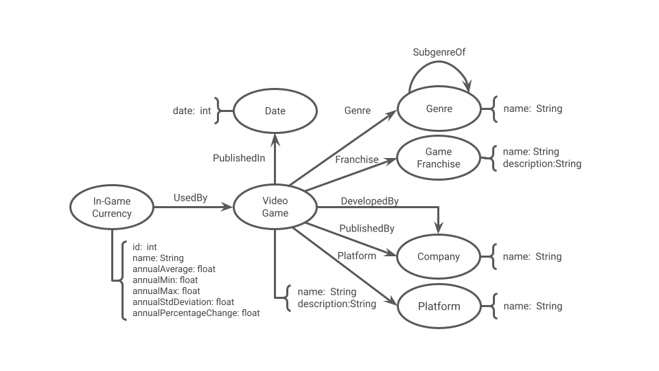

# Equipe `devian` - `DVN`
* Igor Gabriel Cavalcante de Carvalho Borges - 236773

## Modelo Lógico Combinado do Banco de Dados de Grafos

> 

## Perguntas de Pesquisa/Análise Combinadas e Respectivas Análises

### Pergunta/Análise 1
> * Quais gêneros possuem a maior quantidade de moedas?
>   
>   * Simples aplicação de centralidade. Os gêneros com maior _betweenness_ estão relacionados aos com maior número de moedas.

### Pergunta/Análise 2
> * Quais gêneros possuem moedas de maior "sucesso"?
>   
>   * Aplicação de centralidade similar à utilizada anteriormente, combinada com uma aplicação de threshold aos vértices que conectam as moedas aos seus jogos, cuja definição define a métrica de "sucesso" utilizada. Por exemplo, removendo arestas abaixo de um certo ganho percentual anual deixa apenas caminhos para moedas com ganho maior ou igual ao threshold.

### Pergunta/Análise 3
> * Quão relacionados são jogos com moedas de "sucesso"?
>   
>   * Removendo todos os vértices exceto jogos e uma categoria associadas a jogos, como plataforma, se consegue um grafo bipartite. Removendo jogos abaixo de um certo threshold de "sucesso" e aplicando projeção no grafo consegue-se um grafo de relação entre jogos de "sucesso" pela categoria dada. Repetindo o processo para cada categoria e gerando um grafo conectado cujas arestas entre jogos possuem pesos proporcionais ao número (e possivelmente distância) de caminhos entre ambos combinado entre todos eles, apresenta uma métrica de relação entre eles, que pode ser analisada em termos de centralidade ou comunidade
